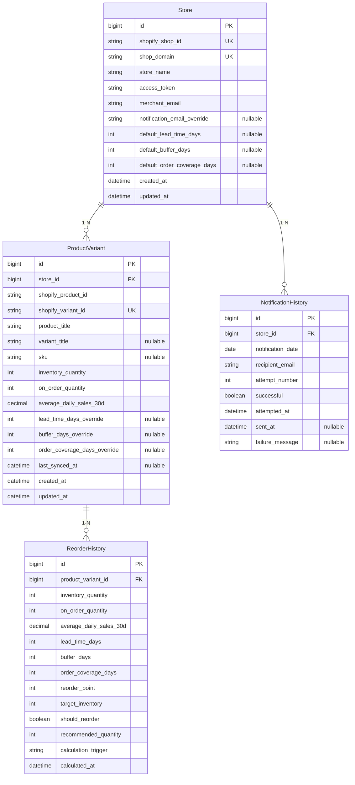

```mermaid
erDiagram
    Store ||--o{ ProductVariant : "1-N"
    Store ||--o{ NotificationHistory : "1-N"
    ProductVariant ||--o{ ReorderHistory : "1-N"
    
    Store {
        bigint id PK
        string shopify_shop_id UK
        string shop_domain UK
        string store_name
        string access_token
        string merchant_email
        string notification_email_override "nullable"
        int default_lead_time_days "nullable"
        int default_buffer_days "nullable"
        int default_order_coverage_days "nullable"
        datetime created_at
        datetime updated_at
    }

    ProductVariant {
        bigint id PK
        bigint store_id FK
        string shopify_product_id
        string shopify_variant_id UK
        string product_title
        string variant_title "nullable"
        string sku "nullable"
        int inventory_quantity
        int on_order_quantity
        decimal average_daily_sales_30d
        int lead_time_days_override "nullable"
        int buffer_days_override "nullable"
        int order_coverage_days_override "nullable"
        datetime last_synced_at "nullable"
        datetime created_at
        datetime updated_at
    }

    ReorderHistory {
        bigint id PK
        bigint product_variant_id FK
        int inventory_quantity
        int on_order_quantity
        decimal average_daily_sales_30d
        int lead_time_days
        int buffer_days
        int order_coverage_days
        int reorder_point
        int target_inventory
        boolean should_reorder
        int recommended_quantity
        string calculation_trigger
        datetime calculated_at
    }

    NotificationHistory {
        bigint id PK
        bigint store_id FK
        date notification_date
        string recipient_email
        int attempt_number
        boolean successful
        datetime attempted_at
        datetime sent_at "nullable"
        string failure_message "nullable"
    }
```
